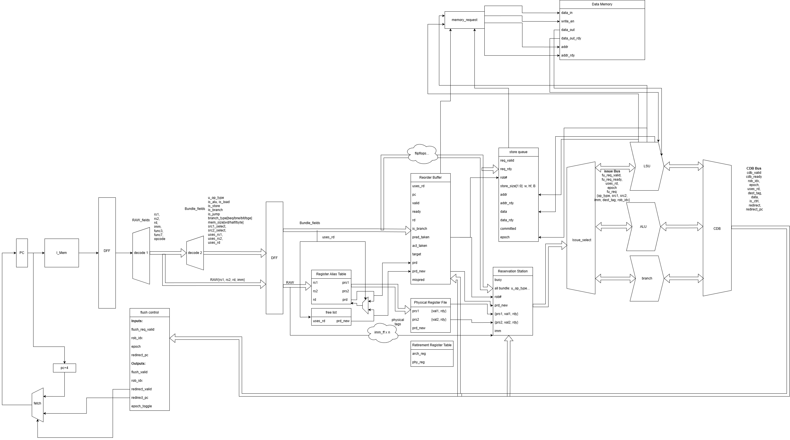

# HanOoO — RV32I Out-of-Order RISC-V Core (from scratch)

HanOoO is a **from-scratch RISC-V RV32I out-of-order processor** focused on learning and real microarchitectural correctness: register renaming, reservation stations, a reorder buffer, a conservative-but-correct LSU, and ROB-based recovery.

This is a **microarchitecture lab project**, not a production CPU.

---

## Highlights

- **RV32I** baseline ISA target (bare-metal oriented)
- **Out-of-order execute, in-order commit**
- **Register renaming + PRF**
- **ROB-based recovery** (branch mispredict, traps/flush boundaries)
- **Conservative loads** (avoid speculative load replay)
- **Store-at-commit** policy (no wrong-path stores reaching memory)
- Designed for **MMIO peripherals** and **accelerator control** (polling-first)

---

## Why this project

Most educational cores are in-order. Most industrial OoO cores are closed.
HanOoO exists to build a mental model you can trust by implementing the real machinery:
- rename / PRF readiness
- wakeup / select / issue
- precise state via ROB commit
- recovery boundaries and squashing
- memory ordering rules that actually hold up

---

## Architecture Overview

## FPGA implementation
So far, only BRAM ip is used. If you want to simulate the system, feel free to use vivado or check out previous RTL files of memory models!

